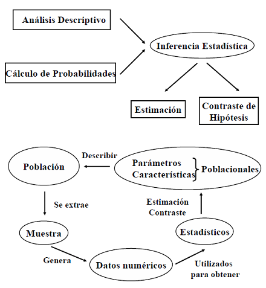
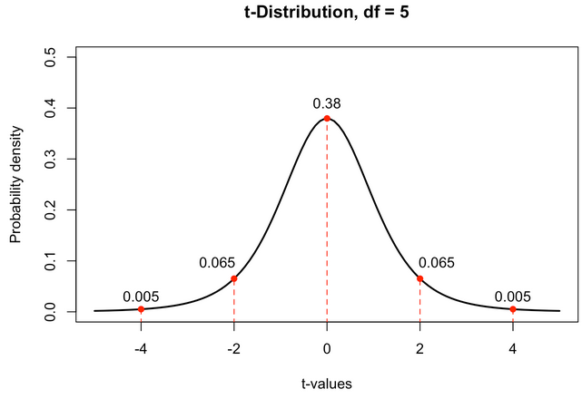
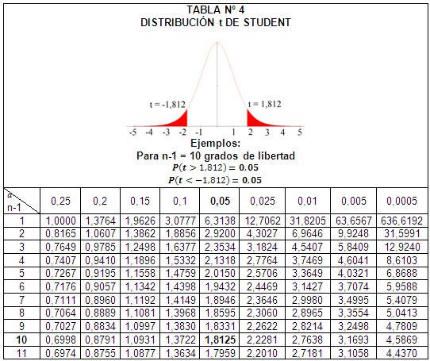

<div style="text-align: justify">

## **Fundamentos de estadística para analítica de Datos.**

## ***Lectura 13: Distribuciones.***

### ***Docente: Luis Andres Campos Maldonado.***

> ## _Software de apoyo: `R`_

---

<font color = "blue" FONT SIZE =6> _Introducción a la Inferencia Estadística._ </font>

Iniciemos con el siguiente diagrama

```{r , echo=FALSE, out.width = '60%', fig.align='center'}

```


Y recordando algunos conceptos:

***Población:*** consiste en la totalidad de las observaciones en las que estamos interesados.

***Observaciones:*** valores que toma la característica observada en cada elemento de la población.

***Parámetro:*** característica numérica que describe una variable observada en la población.

***Muestra:*** Es un subconjunto de la población.

***Estadístico:*** cualquier función de las variables aleatorias que forman una muestra aleatoria se llama *Estadístico*

Supongamos que tenemos una población y queremos obtener información de esta a partir de una muestra. Entonces, nos preguntamos ¿por qué es importante hacer muestreo? Algunas razones son:

1. Tiempo.

2. Costos.

3. No es posible verificar toda la población.

4. Los resultados de las muestras son confiables y no vale la pena tomar toda la población.

La inferencia estadística se basa en el estudio de las muestras y esta debe ser representativa de la población para poder extraer conclusiones validas sobre la población. Y de otra parte esa muestra debe ser aleatoria.

**Muestreo Aleatorio Simple:** Cada elemento de la población tiene la misma
probabilidad de ser elegido para formar parte de la muestra y cada muestra del mismo tamaño tiene la misma probabilidad de ser seleccionada (m.a.s)

**Muestra aleatoria simple de tamaño n:** Sea una población donde observamos la variable aleatoria $X$. Una muestra aleatoria simple (m.a.s.) de tamaño $n$ es un conjunto de $n$ variables aleatorias $X_1, X_2, \dots X_n$ que verifican: son independientes entre si y $X_i$ cada variable aleatoria tiene características similares a $X$.

Dada una población $f(x)$ de tamaño $n$, vamos a definir como $X_i$ la variable aleatoria que representa la $i-ésima$ medición. Supondremos la independencia de las variables $X_1, X_2, \dots, X_n$.

**Definición:** Sean $X_1, X_2, \dots X_n$ variables aleatorias independientes, cada una con la misma distribución de probabilidad. Denominamos a este conjunto como una muestra aleatoria de tamaño $n$ de la población y además, tiene función de densidad conjunta
$$f(x_1,x_2,\dots,x_n)= f(x_1).f(x_2)\dots f(x_n)$$

Antes de comenzar, el análsis de las distribuciones muestrales veamos tres distribuciones importantes asociadas al muestreo y que serán usadas posteriormente. Veremos algunas generalidades de estas distribuciones las cuales serán aplicadas en las próximas secciones para estimar parámetros.

Vamos a conocer y trabajar con variables aleatorias que siguen alguna de las siguientes distribuciones.

> <font color = blue FONT SIZE = 4>***1. Distribución Chi- Cuadrado***</font>

> <font color = blue FONT SIZE = 4>***2. Distribución t-Student***</font>

> <font color = blue FONT SIZE = 4>***3. Distribución F***</font>


<font color = blue FONT SIZE = 5>***1. Distribución Chi- Cuadrado***</font>

Sean $X_1, X_2, X_3, \dots , X_n$, $n$ variables aleatorias que verifican:

   1. Son independientes entre sí.
   
   2. Cada variable $X_i \sim N(0,1)=Z$
   
Definimos la variable aleatoria

$$X= X_1^2+X_2^2+ \dots + X_n^2$$

Entonces, la variable aleatoria $X$ sigue una distribución **Chi-Cuadrado** con $n$ grados de libertad. 

La expresión de la función de densidad es:

$$f(x; v)= \begin{cases} \dfrac{1}{2^{v/2}\Gamma(v/2)}x^{v/2-1}e^{-x/2} & si \quad x>0 \\ 0 & \text{en otro caso} \end{cases}$$
donde $\Gamma(\alpha)$ es la función Gamma y $v$ representa los grados de libertad.

```{r,echo=F,message=FALSE}
library(tidyverse)
```

```{r, echo=F}
data.frame(chisq = 0:7000 / 100) %>% 
           mutate(df_05 = dchisq(x = chisq, df = 7),
                  df_15 = dchisq(x = chisq, df = 15),
                  df_30 = dchisq(x = chisq, df = 30)) %>%
   
gather(key = "df", value = "density", -chisq) %>%
ggplot() +
  geom_line(aes(x = chisq, y = density, color = df)) +
  labs(title = "Chi-Cuadrado con varios grados de libertad",
       x = "Chi-Cuadrado",
       y = "Densidad")
```

***CONCEPTO DE GRADOS DE LIBERTAD:*** El concepto de grados de libertad fue explicado iniciamente por Sir Ronald Fisher (1908), fundador de la estadística moderna. Posteriormente, aparecen con fuerza en los trabajos de Friedrich Gauss en la teoría de los mínimos cuadrados y son muy usados en regresión lineal. Veamos que son los grados de libertad intuitivamente.

*Definiciones*

1. “La suma de los valores de las desviaciones de los valores
individuales con respecto a su media es igual a cero, hecho que
puede demostrarse. Si se conocen los n-1 valores de los valores a
partir de la media, entonces se conoce el n-ésimo valor, ya que
queda determinado automáticamente debido a la restricción de
que todos los valores de n sumen cero”. (Daniel Wayne 2007, p41)


2. “El valor de los grados de libertad se relaciona con el número de
veces que se usa la información de la muestra”. (Dawson 2005,p91)


3. “Se definen como el número de valores que podemos escoger
libremente”. (Levin 1996, p388)

4. “Los grados de libertad de una prueba estadística son el número
de datos que son libres de variar cuando se calcula tal prueba”.
(Pagano 2009, p3216)

**Situación:** Supongamos que queremos escoger a 10 personas de un grupo grande de tal manera que el peso promedio sea $70 \, Kg$ . Evidentemente, hay muchas muestras de tamaño 10, pero estamos condicionados a que el promedio sea $70 \, Kg$. Vamos eligiendo a persona por persona hasta llegar a la persona 9 y la clave esta en que la persona 10 no puede ser cualquiera: esta debe hacer que el promedio sea el que necesitamos. En otras palabras, podemos elegir a 9 libremente y el décimo queda condicionado. Es decir, tenemos 9 grados de libertad.

Ahora bien, veamos un poco más de fondo el asunto. 

Recordemos que

$$\sum \limits _{k=1}^{n} (x_i-\overline{x})=0$$

es decir, que la suma de las diferencia de los datos a la media es cero. Además, tenemos la desviación estándar muestral da una idea del grado de dispersión de los $n$ datos alrededor de la media y esta dada por:

$$S^2=\dfrac{(x_1-\overline{x})^2+(x_2-\overline{x})^2+\dots +(x_n-\overline{x})^2}{n-1}$$

Observe que alguno de los términos $(x_i-\overline{x})^2$ se puede escribir en términos de los otros, en otras palabras, para calcular la desviación estándar muestral tenemos $n-1$ grados de libertad.

<font color=red FONT SIZE=4> ***La distribución Chi-Cuadrado en `R`***</font>

Para el trabajo en R, al igual que en las distribuciones que hemos abordado tenemos las siguientes instrucciones.

- *dchisq(x, df)* evaluar la función de densidad

- *pchisq(x, df, lower.tail)* probabilidad acumulada

- *rchisq(n, df)* $n$ valores aleatorios de la chi-cuadrado con $df$ grados de libertad.

- *qchisq(q, df)* calcula el cuantil para un área dada (=probabilidad)

> <font color=red FONT SIZE=4>***Ejemplo:***</font>

1. Calcular la probabilidad $P(\chi_7^2\leq 6)$ y $P(\chi_7^2 \geq 6)$

```{r}
pchisq(6, df=7, lower.tail = T)
pchisq(6, df=7, lower.tail = F)
```

2. Calcular el valor de $x$ tal que $P(\chi_7^2<x)=0.25$

```{r}
qchisq(0.25, df=7)
```

3. Gráficar el histograma y la curva de densidad de una muestra de 100000 datos que se distribuyen como Chi-cuadrado con $df=7$.
```{r}
x = rchisq(100000, df = 7)
hist(x, 
     breaks = 'Scott', 
     col = "chartreuse",
     freq = FALSE, 
     xlim = c(0,14), 
     ylim = c(0,0.2),
     xlab = " ", 
     main = " Histograma para Chi-Cuadrado con df=7", cex.main=0.9)

curve(dchisq(x, df = 7), from = 0, to = 15, n = 5000, col= 'red', lwd=2, add = T)
```


Finalmente

- $E[\chi^2_n]=n$

- $Var[\chi^2_n]=2n$

- Para valores grandes de $n$, la distribución Chi-cuadrado se aproxima a la distribución Normal. $n>30$.

```{r}
pchisq(40,50)
pnorm(40,50,sqrt(100))
```


<font color = blue FONT SIZE = 5>***2. Distribución t-Student***</font>


En esta sección revisaremos algunos conceptos básicos de la distribución $t$ Student.

Supongamos que tenemos dos variables aleatorias $Y$ y $Z$ tal que:

- $Z$ y $Y$ son independientes.

- $Z \sim N(0,1)$

- $Y \sim \chi^2_n$

Definimos la variable aleatoria

$$X = \dfrac{Z}{\sqrt{Y/n}}$$

La variable aleatoria $X$ sigue una distribución $t$ de Student con $n$ grados de libertad $X \sim t_n$.

Esta distribución se debe a William Gosset (1876-1937) pero que debió usar el seudónimo de $Student$ para nombrar su resultado. 

La $t$ de Student solo tiene un parámetro llamado los grados de libertad $df=n-1$, donde $n$ es el tamaño de la muestra. 

Veamos algunos valores aleatorios de esta distribución e histogramas para diferentes grados de libertad.

```{r}
n = 30
df = n - 1
rt(n, df)
```

```{r, echo=F}
par(mfrow=c(2,2))
hist( rt(1000, 2), breaks = 'Scott', freq = FALSE, main = "t-student: df =2", xlab="",ylab="Densidad")
hist( rt(1000, 5), breaks = 'Scott', freq = FALSE, main = "t-student: df =5", xlab="",ylab="Densidad")
hist( rt(1000, 30), breaks = 'Scott', freq = FALSE, main = "t-student: df =20", xlab="",ylab="Densidad")
hist( rt(1000, 20000), breaks = 'Scott', freq = FALSE, main = "t-student: df =2000", xlab="",ylab="Densidad")
```

La distribución $t-Student$ en `R` se trabaja con las instrucciones: *dt* , *pt*, *qt*, *rt* con los argumentos *pt(x,df)*: dato, grados de libertad.

```{r , echo=FALSE, out.width = '80%', fig.align='center'}

```

```{r}
dt(0,5)
dt(2,5)
```

```{r med1, echo=FALSE, out.width = '80%', fig.align='center'}

```

Veamos algunos ejemplos de cálculo en R.

1. Calcular $P(T \geq 2.20)$ con 11 grados de libertad 

```{r}
pt(2.20,11,lower.tail = F)
```

2. Calcular $P(T \leq 1.69)$ con 32 grados de libertad

```{r}
pt(1.69, 32)
```

3. Calcular $P(T \geq t) = 0.01$ con 23 grados de libertad

```{r}
qt(0.01,23, lower.tail = F)
```

Finalmente

- $E[t_n]=0$

- $Var[t_n]=\dfrac{n}{n-2}$

```{r}
pt(1,50)
pnorm(1, 0 , sqrt(50/48))
```

- Para valores grandes de $n$, la distribución t- de Student se aproxima a la distribución Normal. $n>30$


<font color = blue FONT SIZE = 5>***3. Distribución F***</font>

En esta sección revisaremos algunos conceptos básicos de la distribución $F$ de $Fischer$.

Supongamos que tenemos dos variables aleatorias $U$ y $V$ tal que:

- $U$ y $V$ son independientes.

- $U \sim t(v_{1})$

- $V \sim t(v_{2})$

Definimos la variable aleatoria

$$F = \dfrac{U/v_{1}}{V/v_{2}}$$

La variable aleatoria $F$ sigue una distribución $F$ de $Fischer$ con $v_{1}$ grados de libertad en el numerador y $v_{2}$ grados de libertad en el denominador, notamos esto como $X \sim F_{v_{1},v_{2}}$.


La $F$ de Student solo tiene 2 parámetros: $df_1=v_{1}$ (numerador) y $df_2=v_{2}$ (denominador).

Veamos algunos valores aleatorios de esta distribución e histogramas para diferentes grados de libertad.

```{r}
n = 30
df1 = 5
df2 = 7
rf(n, df1,df2)
```

```{r, echo=F}
par(mfrow=c(2,3))
hist( rf(1000, df1,2), breaks = 'Scott', freq = FALSE, main = "Distribución F: df1 =5 y df2=2", xlab="",ylab="Densidad", col = "skyblue")
hist( rf(1000, df1,5), breaks = 'Scott', freq = FALSE, main = "Distribución F: df1 =5 y df2=5", xlab="",ylab="Densidad", col = "skyblue")
hist( rf(1000, df1,7), breaks = 'Scott', freq = FALSE, main = "Distribución F: df1 =5 y df2=7", xlab="",ylab="Densidad", col = "skyblue")
hist( rf(1000, df1,30), breaks = 'Scott', freq = FALSE, main = "Distribución F: df1 =5 y df2=30", xlab="",ylab="Densidad", col = "skyblue")
hist( rf(1000, df1,2000), breaks = 'Scott', freq = FALSE, main = "Distribución F: df1 =5 y df2=2000", xlab="",ylab="Densidad", col = "skyblue")
```
```{r, echo=F}
par(mfrow=c(2,3))
hist( rf(1000, 2,df2), breaks = 'Scott', freq = FALSE, main = "Distribución F: df1=2 y df2=7", xlab="",ylab="Densidad", col = "skyblue")
hist( rf(1000, 5,df2), breaks = 'Scott', freq = FALSE, main = "Distribución F: df1=5 y df2=7", xlab="",ylab="Densidad", col = "skyblue")
hist( rf(1000, 7, df2), breaks = 'Scott', freq = FALSE, main = "Distribución F: df1=7 y df2=7", xlab="",ylab="Densidad", col = "skyblue")
hist( rf(1000, 30,df2), breaks = 'Scott', freq = FALSE, main = "Distribución F: df1=30 y df2=7", xlab="",ylab="Densidad", col = "skyblue")
hist( rf(1000, 60,90), breaks = 'Scott', freq = FALSE, main = "Distribución F: df1=2000 y df2=7", xlab="",ylab="Densidad", col = "skyblue")
```


La distribución $F$ en `R` se trabaja con las instrucciones: *df* , *pf*, *qf*, *rf* con los argumentos *pf(x,df1,df2)*: dato, grados de libertad.


```{r}
df(0.1,5,7)
df(2,5,7)
```


Veamos algunos ejemplos de cálculo en R.

1. Calcular $P(F_{v_{1},v_{2}} \geq 1.20)$ con 11 grados de libertad en el numerador y 15 en el denominador 

```{r}
pf(1.20,11,15,lower.tail = F)
```

2. Calcular $P(F_{v_{1},v_{2}} \leq 1.69)$ con 32 grados de libertad en el numerador 5 en el denominador

```{r}
pf(1.69, 32,5)
```

3. Calcular $P(F_{v_{1},v_{2}}> f) = 0.01$ con 1 grados de libertad en el numerador y 1 en el denominador

```{r}
qf(0.01,1,1, lower.tail = F)
```

Finalmente

- $E[F_{v_{1},v_{2}}]=\frac{v_{2}}{v_{2}-2}$

- $Var[F_{v_{1},v_{2}}]=\dfrac{2v_{2}^{2}(v_{1}+v_{2}-2)}{v_{1}(v_{2}-2)^{2}(v_{1}-4)}$

<font color = blue FONT SIZE =5> _Distribuciones muestrales._ </font>

Recordemos que un **Estadístico** es una función de los valores de la
muestra. 

Consideremos una población donde $E[X]=\mu$ y $Var[X]=\sigma^2$ representan dos parámetros poblacionales que miden el centro y la variabilidad de la distribución de probabilidad. Estos parámetros son constantes para la población pero en cada muestra son variables.

Definiremos los siguientes estadísticos muestrales.

**Definición:** Si $X_1, X_2, \dots , X_n$ representan una muestra aleatoria de tamaño $n$, entonces la **media de la muestra** se define mediante el estadístico

$$\overline{X}= \dfrac{\sum \limits_{k=1}^{n} X_k}{n}=\dfrac{X_1+X_2+\dots + X_n}{n}$$

**Definición:** Si $X_1, X_2, \dots , X_n$ representan una muestra aleatoria de tamaño $n$, entonces la **varianza muestral** se define mediante el estadístico

$$\hat{\sigma}^2=\dfrac{\sum \limits_{k=1}^{n} (X_k-\overline{X})^2}{n}$$

**Definición:** Si $X_1, X_2, \dots , X_n$ representan una muestra aleatoria de tamaño $n$, entonces la **cuasi-varianza muestral** se define mediante el estadístico

$$S^2=\dfrac{\sum \limits_{k=1}^{n} (X_k-\overline{X})^2}{n-1}$$

Estos estadísticos verifican lo siguiente independiente de la distribución de la variable $X$.

1. $E[\overline{X}]= \mu_{\overline{X}}=\mu$

2. $Var[\overline{X}]=\sigma_{\overline{X}}^2=\dfrac{\sigma^2}{n}$

3. $E[\hat{\sigma^2}]=\dfrac{n-1}{n}\sigma^2$

4. $E[S^2]=\sigma^2$

Uno de los problemas que buscamos resolver es poder plantear determinadas conclusiones sobre los parámetros de la población a través de los resultados obtenidos en una muestra.

Para esto, usamos algunas estadísticas, las cuales son medidas numéricas descriptivas que se calculan a partir de la muestra. Por ejemplo: media, varianza, desviación estándar, etc.

<font color = blue FONT SIZE=4>***Observación:*** </font> 

Estas estadísticas definen una variable aleatoria ya que dependen de la muestra. 


Recordemos:

**Distribución muestral de una estadística:** es la distribución de probabilidad para los posibles valores de la estadística, que resulta cuando muestras aleatorias de tamaño $n$ se sacan repetidamente de la población.

**Inferencia Estadística:** Es la rama de la estadística que se encarga de tomar decisiones o hacer predicciones acerca de parámetros, es decir, las medidas numéricas que caracterizan a una población.

Examinaremos dos métodos para hacer inferencia sobre parámetros

1. Estimación: predecir el valor del parámetro.

2. Prueba de Hipótesis: tomar una decisión sobre el valor del parámetro, con base en alguna idea y determinar la válidez de ese supuesto.
 

<font color = blue FONT SIZE =5> ***Estimación.*** </font>


En la sección anterior supusimos que se conoce la media y la desviación estándar de la población, pero en general no contamos con esta información. En esta sección trataremos  el concepto de ***Estimadores Puntuales***.

Veamos las definiciones:

**Estimador:** es una fórmula o más generalmente una regla que indica cómo calcular la estimación con base a la información de la muestra.

Este tipo de elementos tienen dos formas particulares: puntual y de intervalo.

**Estimación puntual:** Basándose en datos muestrales, se calcula un número para estimar el parámetro poblacional. La fórmula que describe esta situación se denomina estimador puntual y el valor obtenido estimación puntual.


**Estimación por intervalo:** Basándose en datos muestrales, se calculan dos números que forman los extremos de un intervalo en el cuál esperamos que se encuentre el parámetro. La fórmula se denomina estimador de intervalo y el intervalo se conoce comúnmente como *Intervalo de Confianza*

<font color = blue FONT SIZE =4> ***Estimador Puntual.*** </font>


Lo que se espera de la estimación puntual es poder aproximar el valor del parámetro desconocido por medio de un valor numérico haciendo uso de la información de la muestra y estimadores que nos permitan esta aproximación.

Por ejemplo, si queremos estimar la media de la estatura de una población, podemos tomar una muestra y aproximar por medio de la media aritmética, pero también podriamos tratar de usar otros estimadores como por ejemplo, el punto medio de la muestra. El problema radica, en determinar cual es el mejor estimador, es decir, cual se aproxima de mejor forma al valor desconocido de la población.

Veamos otras definiciones:

***Estimador Insesgado:*** Se dice que un estimador de un operador es insesgado si la media de distribución es igual al verdadero valor del parámetro. En caso contrario se dice sesgado. 

Por ejemplo:

1. El parámetro $\mu$ (poblacional): tiene como estimación puntual (muestra) a $\overline{x}$ y además es insesgado $E[\overline{X}]= \mu$.

2. El parámetro $\sigma^2$: tiene dos estimaciones; una insesgada y otra sesgada:

   - $S^2$ es insesgado, ya que $E[S^2]=\sigma^2$
   - $\hat{\sigma}^2$ es sesgado, ya que $E[\hat{\sigma}^2]=\dfrac{n}{n-1}\sigma^2$

3. El parámetro Proporción $p$ es insesgado $E[\hat{p}]=p$

Veamos algunos ejemplos.


> <font color = red FONT SIZE =5> ***Ejemplo 1.*** </font>

Supongamos que queremos estimar la estatura promedio personas. Podemos tomar muestras de tamaño $n$, medir la estatura de esas muestras y sacar la media de cada muestra. Esto es lo que se denomina una estimación puntual. Veamos una idea de la situación en R. Vamos a simular la extracción de una muestra de 90 personas de una distribución normal $N(170, 4.9)$

```{r}
set.seed(1) # fija los elementos de la primera simulación.
n=90 
m1=rnorm(n,170,4.9)  # 90 valores aleatorios
hist(m1, probability = TRUE, col = "green", 
main="90 estaturas muestra 1", ylim= c(0,0.1)) # histograma
rug(m1) #punto en el plano
lines(density(m1), col="red",lwd=2) # linea de densidad
abline(v=c(mean(m1)), col ="blue", lwd =2)
legend(175,0.08,  # posición de la etiqueta
       legend=paste("x1=",c(round(mean(m1),2))), #leyendas
       bty = "n", # forma
       fill=c("red"),  #colores
       ncol=1, #columnas
       cex=1.2) 
```

Podemos tomar otra muestra

```{r}
set.seed(2) # fija los elementos del primer random
n=90 
m2=rnorm(n,170,4.9)  # 90 valores aleatorios
hist(m2, probability = TRUE, col = "green", 
main="90 estaturas muestra 2", ylim= c(0,0.1)) # histograma
rug(m1) #punto en el plano
lines(density(m2), col="red",lwd=2) # linea de densidad
abline(v=c(mean(m2)), col ="blue", lwd =2)
legend(175,0.08,  #posición de la etiqueta
       legend=paste("x2=",c(round(mean(m2),2))), #legendas
       bty = "n", # forma
       fill=c("red"),  #colores
       ncol=1, #columnas
       cex=1.2) 
```

Los valores de $\overline{x_1}$ y $\overline{x_2}$ no tiene que ser iguales. Cada vez que tomemos una muestra obtenemos un valor diferente de $\overline{x_i}$. Es decir, la media muestral es una variable aleatoria. 

Si repetimos este proceso un número grande de veces [La ley de los grandes números](https://en.wikipedia.org/wiki/Law_of_large_numbers) garantiza que la media de estos valores obtenidos en cada medición, se aproxima a la media de la población.

```{r}
set.seed(1)
M = c()
for (i in 1:200) M[i]=mean(rnorm(90,170,4.9))
hist(M, probability = TRUE, col = "yellow", 
main="200 datos de la media", ylim= c(0,0.8))
lines(density(M), col="red",lwd=2)
abline(v=c(mean(M)), col ="blue", lwd =2)
legend(168.5,0.5,  #posición de la etiqueta
       legend=paste("Me=",c(round(mean(M),2))), #legendas
       bty = "n", # forma
       fill=c("red"),  #colores
       ncol=1, #columnas
       cex=1)
```

Observe que la media se aproxima a la media "real" que estabamos suponiendo 170.

> <font color = red FONT SIZE =5> ***Ejemplo 2.*** </font>

Consideremos el experimento donde preguntamos a las personas si tienen mascota. Las posibles respuestas son : "si tiene mascota" o "no tiene mascota". Son dos posibles resultados, con lo cual se determina una variable tipo Bernoulli. LLamemos

- $p$ la proporción de personas que tiene mascota. ( para ejemplificar supongamos que es $70%$)

Vamos a preguntar a 100 personas (tamaño de la muestra)

```{r}
set.seed(1)
b1 = rbinom(100,1,0.70)  
as.data.frame(table(b1), row.names = c("No tiene mascota", "Tiene mascota"))
```

El número 1 es caso de éxito y 0 es fracaso. En este caso, la proporción muestral es $\hat{p_1}= 68/100=0.68$.

Tomemos otra muestra 

```{r}
set.seed(6)
b2=rbinom(100,1,0.70)  
as.data.frame(table(b2), row.names = c("No tiene mascota", "Tiene mascota"))
```

En este caso $\hat{p_2}=65/100=0.65$

Podemos repetir el proceso un número grande de veces.

```{r}
p = c()
for (i in 1:200) {
                  p[i]=mean(rbinom(100,1,0.70))
                 }
##
hist(p, probability = TRUE, col = "pink",  main="200 encuestas")
lines(density(p), col="blue",lwd=2)
##
abline(v=c(mean(p)), col ="black", lwd =2)
##
legend(0.55,6,  #posición de la etiqueta
       legend=paste("Me=",c(round(mean(p),2))), #legendas
       bty = "n", # forma
       fill=c("red"),  #colores
       ncol=1, #columnas
       cex=1)

```

Supongamos muestras de tamaño 6 y repetimos el experimento 20 veces

```{r}
muestras = as.data.frame(matrix(rbinom(6*20, 1, 0.70), ncol=6))
rownames(muestras) = paste("muestra", 1:20, sep=" ")
muestras$mean = rowMeans(muestras[,1:6])
ptilde = muestras$mean
colnames(muestras) = c(paste("obs", 1:6 ,sep=""), " ptilde")
muestras
```

y ahora calculamos la media

```{r}
mean(ptilde)
```

A continuación definiremos que es un estimador insesgado **consistente**

**Definición:** Un estimador insesgado se dice consistente si su varianza tiende a cero cuando $n$ tiende a infinito. 

Lo anterior quiere decir que si tomamos muestras cada vez más grandes la varianza se aproxima a cero y por tanto hay menos dispersión en los valores, lo cual implica que los valores del estimador están muy cerca entre sí.

La media muestral $$\overline{X}= \dfrac{X_1+X_2+\dots + X_n}{n}$$
satisface:

- Es un estimador de $\mu$, la media poblacional.

- Es insesgado

- Es consistente

Además, si $X$ ~ $N(\mu, \sigma)$ entonces $\overline{X}$ ~ $N(\mu, n \sigma^2)$


<font color = blue FONT SIZE =4> ***Intervalo de Confianza.*** </font>

Recordemos que el intervalo de confianza es el conjunto de valores que se forma a partir de una muestra de forma que exista la probabilidad de que el parámetro poblacional ocurra dentro de dicho conjunto con una probabilidad específica. A esta probabilidad se le denomina *nivel de confianza*.

Para calcular el intervalo de confianza para una media poblacional se consideran dos casos:

1. <font color=red FONT SIZE=4> Los datos de la muestra se utilizan para calcular $\mu$ con $\overline{x}$, mientras que la desviación estándar de la población $\sigma$ es conocida </font>

2. <font color=red FONT SIZE=4> Los datos de la muestra se utilizan para calcular $\mu$ con $\overline{x}$, mientras que la desviación estándar de la población $\sigma$ es desconocida</font>

Vamos a examinar cada uno de los casos de manera independiente.

<font color=red FONT SIZE=4> $\sigma^2$ conocido </font>

Vamos a estimar la media $\mu$ a través de la media de una muestra de tamaño grande $n$. Usando el Teorema del Límite Central, sabemos que

$$X \sim N\left(\mu, \dfrac{\sigma^2}{n}\right)$$
Supongamos que queremos un nivel de confianza de $95\%$, es decir

$$P\left( -a <  \dfrac{\overline{X}-\mu}{\sigma/\sqrt{n}} < a \right)=0.95$$
Es decir, requerimos el cuantil 97.50

```{r}
qnorm(0.9750)
```

con lo cual,

$$-1.96 \dfrac{\sigma}{\sqrt{n}} < \overline{X}-\mu < 1.96 \dfrac{\sigma}{\sqrt{n}}$$
$$\overline{X} -1.96 \dfrac{\sigma}{\sqrt{n}} < \mu < \overline{X} +1.96 \dfrac{\sigma}{\sqrt{n}}$$
Esto lo podemos expresar de tal manera que si podemos construir una gran cantidad de intervalos de la forma: 

$$IC(\mu, 0.95)=\left[\overline{X} -1.96 \dfrac{\sigma}{\sqrt{n}} , \overline{X} +1.96 \dfrac{\sigma}{\sqrt{n}} \right]$$
basados en muestras de tamaño $n$, en $95\%$ (nivel de confianza) de los casos van a contener el valor verdadero del parámetro $\mu$.

<font color=red FONT SIZE=4>***Ejemplo.*** </font> Una máquina se encarga de llenar paquetes de harina con una varianza igual a $80$ (las unidades de llenado estan dados en gramos). La máquina estaba calibrada para llenar paquetes con un peso medio (promedio) de una libra. Por fallos eléctricos la máquina está presentando una falla y se quiere determinar cual es la media $\mu$. Se toma una muestra de $49$ paquetes y se calcula el peso medio, obteniendo $480$ gramos. ¿Cuál es el intervalo de confianza con un nivel de confianza del $95\%$ para $\mu$.

**Solución:** Calculamos $\sigma/\sqrt{n}$.

$$\dfrac{\sigma}{\sqrt{n}}=\dfrac{\sqrt{81}}{\sqrt{49}}=\dfrac{9}{7}$$
Así

$$\begin{align*}IC(\mu, 0.95) & = \left[480 -1.96 \dfrac{9}{7} , 480 +1.96 \dfrac{9}{7} \right] \\ & = [477.48, 482.52]\end{align*}$$

Podemos generalizar el resultado anterior, no solo al $95\%$. Escribiremos $Z_{\alpha/2}$ como el valor de $Z$ con área $\alpha/2$ a la derecha, entonces un intervalo de confianza al $(1-\alpha) 100\%$ para la media $\mu$ es:

$$\left[\overline{X} -Z_{\alpha/2} \dfrac{\sigma}{\sqrt{n}} , \overline{X} +Z_{\alpha/2} \dfrac{\sigma}{\sqrt{n}} \right]$$

De acuerdo a la tabla de la Normal Estándar tenemos los siguientes valores de $Z_{\alpha_2}$ para los niveles de confianza más usados: $90\%$ , $95\%$ y $99 \%$

|Nivel de Confianza| $\alpha$  | $\alpha/2$ | $Z_{\alpha/2}$|
|------------------|-----------|------------|---------------|
|$90\%$ | $0.10$ | $0.5$  | $1.645$|
|$95\%$ | $0.05$ | $0.25$ | $1.960$|
|$99\%$ | $0.01$ | $0.05$ | $2.576$|
 
Para calcular los valores de los intervalos de confianza en R, usaremos el paquete *BSDA*

```{r, echo=T, eval=T,warning=FALSE, cache=FALSE, message=FALSE}
library(BSDA)
```

y la instrucción *zsum.test(mean.x=,sigma.x=, n.x=,conf.level=)* donde : mean.x es la media, sigma.x es la desviación estándar, n es el tamaño de la muestra y conf.level, es el nivel de confianza. 

Para el ejemplo anterior, tenemos

```{r}
zsum.test(mean.x=480,sigma.x=sqrt(80), n.x=49,conf.level=0.95)
```
 
<font color=red FONT SIZE=4>***Ejemplo:*** </font> De una cierta población se ha extraído una muestra de 64 individuos, cuyo valor medio es 1012. Se sabe por otras experiencias del mismo tipo, que la desviación típica vale 25. Hallar intervalos de confianza para el valor medio de la población a los niveles de confianza del 0.95 y 0.99. 

**Solución:**

```{r}
zsum.test(mean.x=1012,sigma.x=25, n.x=64,conf.level=0.95)
zsum.test(mean.x=1012,sigma.x=25, n.x=64,conf.level=0.99)
```

<font color = red FONT SIZE = 4>$\sigma^2$ desconocido</font>

Si queremos estimar la media y calcular el intervalo de confianza, podemos evaluar los siguientes casos:

1. Tamaño muestral es grande: $n \geq 30$.

Si tenemos el caso en que $\sigma^2$ es desconocida, podemos aproximarla por la desviación estándar $S$ cuando el tamaño muestral sea grande $n \geq 30$ y el intervalo aproximado de confianza es 

$$\overline{X} \pm Z_{\alpha/2} \dfrac{S}{\sqrt{n}}$$

Veamos un par de ejemplos:

<font color=red FONT SIZE=4>***Ejemplo 1 ($n$ grande y $\sigma$ desconocido)*** </font>

Un científico interesado en vigilar contaminantes químicos en alimentos y, por lo tanto, la acumulación de contaminantes en la dieta humana, seleccionó una muestra aleatoria de $n = 50$ adultos hombres. Se encontró que el promedio de ingesta diaria de productos lácteos fue de $ \overline{X} = 756$ gramos por día, con una desviación estándar de $S = 35$ gramos por día. Use esta información muestral para construir un intervalo de confianza de 95% para la ingesta diaria media de productos lácteos para hombres.

**Solución:** En este caso tenemos lo siguiente: como $n$ es grande ($n>30$) podemos usar el Teorema del Límite Central y entonces $\overline{X}$ se distribuye como una Normal $\overline{X} \sim N(\mu, \frac{\sigma^2}{n})$. Pero no conocemos $\sigma$, sin embargo, como la muestra es grande podemos aproximar a $\sigma$ con $S$. En este caso $X \sim N(\mu, \frac{S^2}{n})$. Por lo tanto,

```{r}
zsum.test(mean.x=756,sigma.x=35, n.x=50,conf.level=0.95)
```
Es decir el intervalo de confianza con un nivel de significancia es $[746.29, 765.7013]$


> <font color=red FONT SIZE=4>***Ejercicio para casa  ($n$ grande y $\sigma$ conocido)*** </font>

 La revista Playbill reportó que el ingreso familiar anual medio de sus suscriptores es $\$119155$ (Playbill, enero de 2006). Suponga que la estimación del ingreso familiar anual medio está basada en una muestra de 80 familias y que por datos de estudios anteriores la desviación estándar poblacional es conocida $\sigma = \$30000$. Calcule el intervalo de confianza en los tres escenarios: $90\%$ , $95\%$ y $99\%$. Compare los resultados. ¿Qué puede concluir?

