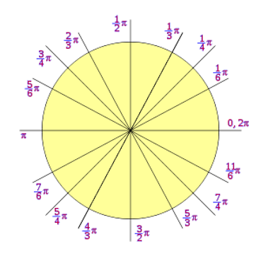

## _Bienvenidos_

- Clases: Jueves 6 PM - 9 PM -- Sábados 9 AM - 11 AM

# Conociendo R


## ¿Qué es R?

<div class="aligncenter"> 
  
</div>


- Entorno de programación para el análisis estadístico y gráfico de datos
- Software libre.
- Sintaxis sencilla e intuitiva.
- Enorme comunidad de usuarios (Comprehensive R Archive Network, CRAN)
- Necesitamos instalar R. [Instalación R](https://cran.r-project.org/)

## ¿Qué es RStudio?

En este curso usaremos RStudio como interfaz gráfica de usuario de R para todos los sistemas operativos

Es un entorno integrado para utilizar y programar con R


- Seguido instalar R-studio [Instalación R-studio](https://www.rstudio.com/products/rstudio/download/)

<div class="aligncenter">

</div>

## Cómo pedir ayuda

- ```help()```: obtener ayuda por consola
- ```??...```: obtener ayuda por consola
- Pestaña ```Help``` de Rstudio
- Buscar en San Google (stackoverflow, R project...)


## Paquetes: cómo instalarlos y cargarlos

<l class="definition">Paquete.</l> Librería con funciones y datos que no necesariamente vienen instaladas de serie 

- `install.packages("nombre_paquete", dep = TRUE)`: instala o actualiza un paquete de R.
- ```library(nombre_del_paquete)```: carga un paquete ya instalado.

# Utilizando R como calculadora

## Calculadora básica - Operaciones

Código |  Operación                                
--------------------|--------------------
```+``` | Suma
```-``` | Resta 
```*```  | Multiplicación
```/``` | División 
```^``` | Potencia 
```%/%``` | Cociente entero
``%%`` | Resto de división entera

## Calculadora básica - Operaciones

Código |  Significado                                 
--------------------|--------------------
```pi``` | [$\pi$](https://es.wikipedia.org/wiki/Número_π) 
`Inf` | [$\infty$](https://es.wikipedia.org/wiki/Infinito)
`NaN` | Indeterminación (Not a Number)
`NA` | Valor desconocido (Not Available)

## Calculadora básica - Funciones 
Código |  Función                            
--------------------|--------------------
```sqrt(x)``` | $\sqrt{x}$
```exp(x)``` | $e^x$  
```log(x)``` | $\ln(x)$
```log10(x)``` | $\log_{10}(x)$
```log(x,a)``` | $\log_a(x)$ 
```abs(x)``` | $\begin{vmatrix}x\end{vmatrix}$


## Calculadora básica - Combinatoria

Código |  Operación                                 
--------------------|--------------------
```factorial(x)``` | [$x!$](https://es.wikipedia.org/wiki/Factorial)  
```choose(n,m)``` | $\begin{pmatrix}n\\ m\end{pmatrix}$   


\vspace{0.2cm}

- <l class="definition">Número factorial.</l> Se define como número factorial de un número entero positivo $n$ como $n!=n\cdot(n-1)\cdots 2\cdot 1$
- <l class="definition">[Coeficiente binomial](https://es.wikipedia.org/wiki/Coeficiente_binomial).</l> Se define el coeficiente binomial de $n$ sobre $m$ como $$\begin{pmatrix}n\\ m\end{pmatrix}=\frac{n!}{m!(n-m)!}$$

## Calculadora básica - Combinatoria

<l class="definition">[Triángulo de Pascal](https://es.wikipedia.org/wiki/Triángulo_de_Pascal).</l>
\usepackage{mathdots}
\usepackage{yhmath}
\usepackage{mathdots}
\usepackage{MnSymbol}
$$\begin{matrix}
&&&&&1&&&&&\\
&&&&1&&1&&&&\\
&&&1&&2&&1&&&\\
&&1&&3&&3&&1&&\\
&1&&4&&6&&4&&1&\\
1&&5&&10&&10&&5&&1\end{matrix}$$

que se corresponde con ...

$$\begin{matrix}
&&&&\begin{pmatrix}0\\0\end{pmatrix}&&&&\\
&&&\begin{pmatrix}1\\0\end{pmatrix}&&\begin{pmatrix}1\\1\end{pmatrix}&&&\\
&&\begin{pmatrix}2\\0\end{pmatrix}&&\begin{pmatrix}2\\1\end{pmatrix}&&\begin{pmatrix}2\\2\end{pmatrix}&&\\
&\begin{pmatrix}3\\0\end{pmatrix}&&\begin{pmatrix}3\\1\end{pmatrix}&&\begin{pmatrix}3\\2\end{pmatrix}&&\begin{pmatrix}3\\3\end{pmatrix}&\\
\begin{pmatrix}4\\0\end{pmatrix}&&\begin{pmatrix}4\\1\end{pmatrix}&&\begin{pmatrix}4\\2\end{pmatrix}&&\begin{pmatrix}4\\3\end{pmatrix}&&\begin{pmatrix}4\\4\end{pmatrix}\end{matrix}$$

## Trigonometría en radianes

Código |  Función                                 
--------------------|--------------------
```sin(x)``` | $\sin(x)$
```cos(x)``` | $\cos(x)$
```tan(x)``` | $\tan(x)$
```asin(x)``` | $\arcsin(x)$
```acos(x)``` | $\arccos(x)$
```atan(x)``` | $\arctan(x)$

## Trigonometría en radianes

<div class = "aligncenter">

</div>

## Números en coma flotante

Código |  Función                                 
-------|--------------------
```print(x,n)``` | Muestra las $n$ cifras significativa del número $x$
```round(x,n)``` | Redondea a $n$ cifras significativas un resultado o vector numérico $x$
```floor(x)``` | $\lfloor x\rfloor$, parte entera por defecto de $x$
```ceiling(x)``` | $\lceil x\rceil$, parte entera por exceso de $x$
```trunc(x)``` | Parte entera de $x$, eliminando la parte decimal


## Variables y funciones

- `nombre_variable = valor`: define una variable con dicho valor
- `nombre_función = function(variable){función}`: define una función


## Números complejos

Código |  Función                                 
--------------------|--------------------
 ```a+bi``` | [Número complejo](https://es.wikipedia.org/wiki/Número_complejo)
```complex(real=...,imaginary=...)``` | Número complejo en forma pura.
```complex(modulus=...,argument=...)``` | Número complejo en forma polar.

## Números complejos

Código |  Función                                 
--------------------|--------------------
```sqrt(as.complex(-x))``` | $\sqrt{-x}$
```Re(x)``` | Parte real de $x$
```Im(x)``` | Parte imaginaria de $x$
```Mod(x)``` | Módulo de $x$
```Arg(x)``` | Argumento de $x$
``Conj(x)`` | Conjugado de $x$


## Números complejos

<div class="aligncenter">


</div>


## R Markdown

##############################################################################
##############################################################################
Este es un documento R Markdown. Markdown es una sintaxis de formato simple para crear documentos HTML, PDF y MS Word. Para obtener más detalles sobre el uso de R Markdown, consulte: <http://rmarkdown.rstudio.com>.

Este un tipo de fichero en el cual podemos intercalar sin problema alguno texto, código y fórmulas matemáticas.

- ¿Tienes dudas de por qué usarlo? [Haz click aquí](https://www.r-bloggers.com/why-use-r-five-reasons/)


Al hacer clic en el botón **Knit**, se generará un documento que incluye tanto el contenido como la salida de cualquier fragmento de código R incrustado dentro del documento.


Para la mayor parte de las necesidades de este curso, en lo referente a la creación y composición de este tipo de ficheros, el documento *[Markdown Quick Reference](https://en.support.wordpress.com/markdown-quick-reference/)* de R Markdown deberían ser suficientes.

Sin embargo, a lo largo de este curso iremos ampliando estos contenidos en algunos temas cuando lo creamos necesario.

Nosotros, en este tema, veremos cómo controlar el comportamiento de los bloques de código al compilar el fichero R Markdown y cómo escribir fórmulas matemáticas bien formateadas.

## Fórmulas matemáticas

Para escribir fórmulas matemáticas bien formateadas utilizaremos la sintaxis $\LaTeX$

   - Para tener ecuaciones o fórmulas en el mismo párrafo, escribimos nuestro código entre dos símbolos de dólar: `$`código`$`
   - Si queremos tener ecuaciones o fórmulas centradas en un párrafo aparte, escribimos nuestro código entre dos dobles símbolos de dólar:  `$$`código`$$`
   
  - Al escribir una fórmula de la forma indicada anteriormente o simplemente texto en R Markdown, los espacios en blanco son completamente ignorados. RStudio solamente añade los espacios en blanco a partir del significado lógico de sus elementos.

## Símbolos 

Hay muchísimos símbolos matemáticos que puedes escribirse con la sintaxis $\LaTeX$. En el ejemplo anterior ya hemos mostrado unos pocos. En este tema, nosotros solo veremos los más utilizados.

Para quien quiera ir más allá, aquí un
[documento muy útil](http://www.ptep-online.com/ctan/symbols.pdf) con gran cantidad de símbolos de $\LaTeX$.

## Símbolos matemáticos - Básico

Significado |  Código  |  Resultado                                
--------------------|--------------------|--------------------
Suma | `+`    | $+$              
Resta | `-` | $-$               
Producto | `\cdot` | $\cdot$                     
Producto | `\times` | $\times$ 
División | `\div` | $\div$
Potencia | `a^{x}` | $a^{x}$
Subíndice | `a_{i}` | $a_{i}$
Fracción | `\frac{a}{b}`    | $\frac{a}{b}$              
Más menos | `\pm` | $\pm$
Raíz n-ésima | `\sqrt[n]{x}` | $\sqrt[n]{x}$
Unión | `cup` | $\cup$                     
Intersección | `\cap` | $\cap$  
OR lógico | `\vee` | $\vee$
AND lógico | `\wedge` | $\wedge$
 
## Símbolos matemáticos - Relaciones

Significado |  Código  |  Resultado                                
--------------------|--------------------|--------------------
Igual | `=` | $=$
Aproximado | `\approx` | $\approx$
No igual | `\ne` | $\ne$  
Mayor que | `>` | $>$
Menor que | `<` | $<$
Mayor o igual que | `\ge`    | $\ge$              
Menor o igual que | `\le` | $\le$

## Símbolos matemáticos - Operadores

Significado |  Código  |  Resultado                                
--------------------|--------------------|--------------------
Sumatorio | `\sum_{i=0}^{n}` | $\sum_{i=0}^{n}$
Productorio | `\prod_{i=0}^{n}` | $\prod_{i=0}^{n}$
Integral | `\int_{a}^{b}` | $\int_{a}^{b}$  
Unión (grande) | `\bigcup` | $\bigcup$
Intersección (grande) | `\bigcap` | $\bigcap$
OR lógico (grande) | `\bigvee`    | $\bigvee$              
AND lógico (grande) | `\bigwedge` | $\bigwedge$

## Símbolos matemáticos - Delimitadores

Significado |  Código  |  Resultado                                
--------------------|--------------------|--------------------
Paréntesis | `()` | $(\ )$
Corchetes | `[]` | $[\ ]$
Llaves | `\{ \}` | $\{\ \}$  
Diamante | `\langle \rangle` | $\langle\ \rangle$
Parte entera por defecto | `\lfloor \rfloor` | $\lfloor\  \rfloor$
Parte entera por exceso | `\lceil \rceil`    | $\lceil\ \rceil$
Espacio en blanco | `hola\ caracola` | $hola\ caracola$
## Símbolos matemáticos - Letras griegas

Significado |  Código  |  Resultado                                
--------------------|--------------------|--------------------
Alpha | `\alpha` | $\alpha$
Beta | `\beta` | $\beta$
Gamma | `\gamma \Gamma` | $\gamma\  \Gamma$  
Delta | `\delta \Delta` | $\delta\  \Delta$
Epsilon | `\epsilon` | $\epsilon$
Epsilon | `\varepsilon`    | $\varepsilon$              
Zeta | `\zeta` | $\zeta$

## Símbolos matemáticos - Letras griegas

Significado |  Código  |  Resultado                                
--------------------|--------------------|--------------------
Eta | `\eta` | $\eta$
Theta | `\theta \Theta` | $\theta\ \Theta$
Kappa | `\kappa` | $\kappa$  
Lambda | `\lambda \Lambda` | $\lambda\  \Lambda$
Mu | `\mu` | $\mu$
Nu | `\nu`    | $\nu$              
Xi | `\xi \Xi` | $\xi\ \Xi$

## Símbolos matemáticos - Letras griegas

Significado |  Código  |  Resultado                                
--------------------|--------------------|--------------------
Pi | `\pi \Pi` | $\pi\ \Pi$
Rho | `\rho` | $\rho$
Sigma | `\sigma \Sigma` | $\sigma\ \Sigma$  
Tau | `\tau` | $\tau$
Upsilon | `\upsilon \Upsilon` | $\upsilon\ \Upsilon$
Phi | `\phi \Phi`    | $\phi\ \Phi$              
Phi | `\varphi` | $\varphi$

## Símbolos matemáticos - Letras griegas

Significado |  Código  |  Resultado                                
--------------------|--------------------|--------------------
Chi | `\chi` | $\chi$
Psi | `\psi \Psi` | $\psi\ \Psi$
Omega | `\omega \Omega` | $\omega\ \Omega$ 


## Símbolos matemáticos - Acentos matemáticos

Significado |  Código  |  Resultado                                
--------------------|--------------------|--------------------
Gorrito | `\hat{x}` | $\hat{x}$
Barra | `\bar{x}` | $\bar{x}$
Punto 1 | `\dot{x}` | $\dot{x}$
Punto 2 | `\ddot{x}` | $\ddot{x}$ 
Punto 3 | `\dddot{x}` | $\dddot{x}$ 
Tilde | `\tilde{x}` | $\tilde{x}$
Vector | `\vec{x}` | $\vec{x}$

## Símbolos matemáticos - Acentos expansibles

Significado |  Código  |  Resultado                                
--------------------|--------------------|--------------------
Gorrito | `\widehat{xyz}` | $\widehat{xyz}$
Barra | `\overline{xyz}` | $\overline{xyz}$
Subrallado | `\underline{xyz}` | $\underline{xyz}$
Llave superior | `\overbrace{xyz}` | $\overbrace{xyz}$ 
Llave inferior | `\underbrace{xyz}` | $\underbrace{xyz}$ 
Tilde | `\widetilde{xyz}` | $\widetilde{xyz}$
Vector | `\overrightarrow{xyz}` | $\overrightarrow{xyz}$

## Símbolos matemáticos - Flechas

Significado |  Código  |  Resultado                                
--------------------|--------------------|--------------------
Simple | `\leftarrow \rightarrow` | $\leftarrow\ \rightarrow$
Doble | `\Leftarrow \Rightarrow` | $\Leftarrow\ \Rightarrow$
Simple larga | `\longleftarrow \longrightarrow` | $\longleftarrow\  \longrightarrow$
Doble larga | `\Longleftarrow \Longrightarrow` | $\Longleftarrow\ \Longrightarrow$ 
Doble sentido simple | `\leftrightarrow` | $\leftrightarrow$ 
Doble sentido doble | `\Leftrightarrow` | $\Leftrightarrow$

## Símbolos matemáticos - Flechas

Significado |  Código  |  Resultado                                
--------------------|--------------------|--------------------
Doble sentido larga simple | `\longleftrightarrow` | $\longleftrightarrow$
Doble sentido larga doble | `\Longleftrightarrow` | $\Longleftrightarrow$
Mapea | `\mapsto` | $\mapsto$
Arriba | `\uparrow` | $\uparrow$ 
Abajo | `\downarrow` | $\downarrow$ 

## Símbolos matemáticos - Funciones

Significado |  Código  |  Resultado                                
--------------------|--------------------|--------------------
Seno | `\sin` | $\sin$
Coseno | `\cos` | $\cos$
Tangente | `\tan` | $\tan$
Arcoseno | `\arcsin` | $\arcsin$ 
Arcocoseno | `\arccos` | $\arccos$ 
Arcotangente | `\arctan` | $\arctan$

## Símbolos matemáticos - Funciones

Significado |  Código  |  Resultado                                
--------------------|--------------------|--------------------
Exponencial | `\exp` | $\exp$
Logaritmo | `\log` | $\log$
Logaritmo neperiano | `\ln` | $\ln$
Máximo | `\max` | $\max$ 
Mínimo | `\min` | $\min$ 
Límite | `\lim` | $\lim$


## Símbolos matemáticos - Funciones

Significado |  Código  |  Resultado                                
--------------------|--------------------|--------------------
Supremo | `\sup` | $\sup$
Ínfimo | `\inf` | $\inf$
Determinante | `\det` | $\det$
Argumento | `\arg` | $\arg$ 

## Símbolos matemáticos - Otros

Significado |  Código  |  Resultado                                
--------------------|--------------------|--------------------
Puntos suspensivos bajos | `\ldots` | $\ldots$
Puntos suspensivos centrados | `\cdots` | $\cdots$
Puntos suspensivos verticales | `\vdots` | $\vdots$
Puntos suspensivos diagonales | `\ddots` | $\ddots$
Cuantificador existencial | `\exists` | $\exists$
Cuantificador universal | `\forall` | $\forall$
Infinito | `\infty` | $\infty$

## Símbolos matemáticos - Otros

Significado |  Código  |  Resultado                                
--------------------|--------------------|--------------------
Aleph | `\aleph` | $\aleph$
Conjunto vacío | `\emptyset` | $\emptyset$
Negación | `\neg` | $\neg$
Barra invertida | `\backslash` | $\backslash$
Dollar | `\$` | $\$$ 
Porcentaje | `\%` | $\%$
Parcial | `\partial` | $\partial$

## Símbolos matemáticos - Tipos de letra

Significado |  Código  |  Resultado                                
--------------------|--------------------|--------------------
Negrita | `\mathbf{palabra}` | $\mathbf{palabra}$
Negrita | `\boldsymbol{palabra}` | $\boldsymbol{palabra}$
Negrita de pizarra | `\mathbb{NZQRC}` | $\mathbb{NZQRC}$
Caligráfica | `\mathcal{NZQRC}` | $\mathcal{NZQRC}$
Gótica | `\mathfrak{NZQRC}` | $\mathfrak{NZQRC}$

## Observaciones

- A la hora de componer en el interior de un párrafo una fracción, existen dos formas: adaptada al tamaño del texto,`$\frac{a}{b}$`, que resulta en $\frac{a}{b}$; o a tamaño real, `$\dfrac{a}{b}$`, que da lugar a $\dfrac{a}{b}$.

- Podemos especificar que los delimitadores se adapten a la altura de la expresión que envuelven utilizando `\left` y `\right`. Observad el cambio en el siguiente ejemplo: `$(\dfrac{a}{b})$` y `$\left(\dfrac{a}{b}\right)$` producen, respectivamente $(\dfrac{a}{b})$ y $\left(\dfrac{a}{b}\right)$.

## Matrices

`$$\begin{matrix}
a_{11} & a_{12} & a_{13}\\
a_{21} & a_{22} & a_{23}
\end{matrix}$$`

$$\begin{matrix}
a_{11} & a_{12} & a_{13}\\
a_{21} & a_{22} & a_{23}
\end{matrix}$$

`$$\begin{pmatrix}
a_{11} & a_{12} & a_{13}\\
a_{21} & a_{22} & a_{23}
\end{pmatrix}$$`

$$\begin{pmatrix}
a_{11} & a_{12} & a_{13}\\
a_{21} & a_{22} & a_{23}
\end{pmatrix}$$

## Matrices

`$$\begin{vmatrix}
a_{11} & a_{12} & a_{13}\\
a_{21} & a_{22} & a_{23}
\end{vmatrix}$$`

$$\begin{vmatrix}
a_{11} & a_{12} & a_{13}\\
a_{21} & a_{22} & a_{23}
\end{vmatrix}$$

`$$\begin{bmatrix}
a_{11} & a_{12} & a_{13}\\
a_{21} & a_{22} & a_{23}
\end{bmatrix}$$`

$$\begin{bmatrix}
a_{11} & a_{12} & a_{13}\\
a_{21} & a_{22} & a_{23}
\end{bmatrix}$$

## Matrices

`$$\begin{Bmatrix}
a_{11} & a_{12} & a_{13}\\
a_{21} & a_{22} & a_{23}
\end{Bmatrix}$$`

$$\begin{Bmatrix}
a_{11} & a_{12} & a_{13}\\
a_{21} & a_{22} & a_{23}
\end{Bmatrix}$$

`$$\begin{Vmatrix}
a_{11} & a_{12} & a_{13}\\
a_{21} & a_{22} & a_{23}
\end{Vmatrix}$$`

$$\begin{Vmatrix}
a_{11} & a_{12} & a_{13}\\
a_{21} & a_{22} & a_{23}
\end{Vmatrix}$$

## Sistema de ecuaciones

`\begin{array}{l}\end{array}` nos produce una tabla alineada a la izquierda. El hecho de introducir el código `\left. \right.` hace que el delimitador respectivo no aparezca.

`$$\left.\begin{array}{l}
ax+by=c\\
ex-fy=g
\end{array}\right\}$$`
    
$$\left.\begin{array}{l}
ax+by=c\\
ex-fy=g
\end{array}\right\}$$

`$$|x|=\left\{\begin{array}{l}
-x & \text{si }x\le 0\\
x & \text{si }x\ge 0
\end{array}\right.$$`
    
$$|x|=\left\{\begin{array}{l}
-x & \text{si }x\le 0\\
x & \text{si }x\ge 0
\end{array}\right.$$

La función `text{}` nos permite introducir texto en fórmulas matemáticas.

# Chunks de R

Chunk: Bloque de código.

Son los bloques de código de R dentro de un documento R Markdown.

Hay diversas opciones de crear un bloque de código de R:

- Ir al menú desplegable de "Chunks" y seleccionar el de R
- Introducir manualmente
- Alt + Command + I (para Mac) o Alt + Control + I (para Windows)


A los chunks se les puede poner etiqueta, para así localizarlos de manera más fácil.


## Parámetros de los chunks

La parte entre llaves también puede contener diversos parámetros, separados por comas entre ellos y separados de la etiqueta (o de r, si hemos decidido no poner ninguna).

Estos parámetros determinan el comportamiento del bloque al compilar el documento pulsando el botón `Knit` situado en la barra superior del área de trabajo.

Código |  Significado                                  
--------------------|--------------------
`echo` | Si lo igualamos a `TRUE`, que es el valor por defecto, estaremos diciendo que queremos que se muestre el código fuente del chunk. En cambio, igualado a `FALSE`, no se mostrará
`eval` | Si lo igualamos a `TRUE`, que es el valor por defecto, estaremos diciendo que queremos que se evalúe el código. En cambio, igualado a `FALSE`, no se evaluará
`message` | Nos permite indicar si queremos que se muestren los mensajes que R produce al ejecutar código. Igualado a `TRUE` se muestran, igualado a `FALSE` no
`warning` | Nos permite indicar si queremos que se muestren los mensajes de advertencia que producen algunas funciones al ejecutarse. Igualado a `TRUE` se muestran, igualado a `FALSE` no

Nota: Con `comment=NA` evita que aparezcan los `##`

Significado |  Código  |  Resultado                                
--------------------|--------------------|--------------------
`results` | `markup` | Valor por defecto. Nos muestra los resultados en el documento final línea a línea, encabezados por `##`
`results` | `hide` | No se nos muestra el resultado en el documento final
`results` | `asis` | Nos devuelve los resultados línea a línea de manera literal en el documento final y el programa con el que se abre el documento final los interpreta como texto y formatea adecuadamente
`results` | `hold` | Miestra todos los resultados al final del bloque de código
 

## Los chunks en modo línea

Para introducir una parte de código dentro de un párrafo y que se ejecute al compilarse el documento mostrando así el resultado final, hay que hacerlo utilizando `` `r "\u0060r ...\u0060"` ``


**Ejemplo**

La raíz cuadrada de 64 es  `r " sqrt(64)"`  o, lo que viene siendo lo mismo, $\sqrt{64}=$ `r sqrt(64)`

La raíz quinta de 32 es `r 2` siendo lo mismo, $\sqrt[5]{32}=$ `r 32^{1/5}`.

# GRACIAS... :)