<div style="text-align: justify">

## **Fundamentos de estadística para analítica de Datos.**

## ***Lectura 9: Probabilidad y técnicas de conteo.***

### ***Docente: Luis Andres Campos Maldonado.***


Supongamos el lanzamiento de 2 dados. ¿Cuales son los posibles resultados?

```{r}
dado1 = c(1,2,3,4,5,6) ## Vector.
dado2 = c(1,2,3,4,5,6) ## Vector.
##
sample(dado1,1,replace = TRUE) ## Simulamos el lanzamiento de un dado.
```

Las posibilidades así como la cantidad de elementos es:

```{r}
count = 0
for (i in dado1){
    for (j in dado2){
        count = count +1    
        print(c(i,j))
                     }
                }
count
```

Sabemos que tenemos 36 posibles resultados, pues en cada dado tenemos 6 opciones de resultado.

$$(i,j),\ \ 1\leq i,j \leq 6$$

Vamos a similar el lanzamiento de un dado 100000000 veces:

```{r}
simu = sample(dado1, 100,replace = TRUE)
```

***Ejercicio:*** ¿Cuantas veces se obtuvo el número 2?


```{r}
sprintf("La cantidad de veces que aparece 2 en la simulación es: %s",sum(simu == 2))
```
Hay dos tipos de experimentos:

**Experimentos Deterministas:** Se obtiene el mismo resultado cuando se realizan con las mismas condiciones. Hay una ley que predice las mediciones

**Experimentos Aleatorios:** No producen los mismos resultados con las mismas condiciones iniciales. 

***Ejemplo:*** Determine cuáles de los siguientes experimentos son deterministas y cuáles aleatorios

  + Dejar caer un objeto y medir el tiempo.
  
  + Lanzar un dado y observar el número que sale.
  
  + Inflar un globo y determinar el volumen.
  
  + Sacar de un maso de cartas una carta al azar.
  
  + Calcular el tiempo que tarda un auto en recorrer cierta distancia.
  
  + Seleccionar una persona al azar y determinar su profesión.

### ***Definición [Espacio Muestral]:*** 

El espacio muestral de un determinado experimento es el conjunto de todos los posibles resultados. Denotaremos este espacio por $S$ u $\Omega$.

Veamos algunos ejemplos:

* Experimento: Lanzar una moneda.

$$\Omega=\{Cara\, , \, Sello\}$$

* Experimento: Lanzar dos monedas. En este caso el espacio muestral estará dado por todas las parejas que identifican los resultados en la moneda 1 y la moneda 2.

$$ \Omega=\{(Cara, Cara) , (Cara, Sello) , (Sello, Cara) , (Sello, Sello) \} $$

- Experimento: Seleccionar un punto en una placa circular de radio $1$ y centro en el origen.

$$\Omega = \{(x,y) \in R^2 : x^2+y^2 \leq 1\}$$

#### ***Definición [Evento]:***

Dado un experimento aleatorio con espacio muestral $\Omega$, se llama *evento* o suceso a cualquier subconjunto del espacio muestral. Generalmente se denota con letras mayúsculas A, B, C, E, etc. 

Nota: cuando el evento es el resultado de una sola repetición se denomina *evento simple*. También se dice simple si consta de un solo resultado del experimento aleatorio, si consta de más de un resultado se dice *compuesto*.

Algunos ejemplos

- Experimento: Lanzar un dado y observar el número de la cara posterior. En este caso tenemos seis eventos simples. Puede salir cualquiera de los seis números: $E_1=\{1\}$, $E_2=\{2\}$, $E_3=\{3\}$, $E_4=\{4\}$, $E_5=\{5\}$, $E_6=\{6\}$

- Experimento: Lanzar una moneda y observar la marca posterior. En este caso tenemos dos eventos,  Que salga cara $E_1=\{cara\}$ y que salga sello $E_2=\{sello\}$

**Observaciones**

   + $E=\phi$ es el evento vacío o que nunca ocurre.
   
   + $E= \Omega$ es el evento seguro o que siempre ocurre.
   
***Ejemplo:*** Participamos en un sorteo de un premio con una rifa del 1 al 50. En este caso los posibles resultados están dados por $\Omega = \{1,2,3 \dots , 50\}$. Algunos eventos son:

- $A$: El número ganador es par. En este caso $A=\{2,4,6, \dots 50\}=\{2k \mid k \in Z \, , \,  k \in [1,25]\}$. (evento compuesto)

- $B$: El número es mayor que 30. Luego, $B=\{31, 32, \dots, 50\}$. (evento compuesto)

- $C$: El número ganador es 46. Luego $C=\{46\}$. (simple)

Como los eventos corresponden a subconjuntos del espacio muestral revisaremos rápidamente algunas operaciones con conjuntos.

### ***Operaciones básicas con conjuntos.***


Considere un experimento aleatorio con espacio muestral $\Omega$. Sean $A$ y $B$ dos eventos de $\Omega$, es decir, $A \subset \Omega$ y $B \subset \Omega$

#### ***Complemento de un Conjunto.***


El complemento de un conjunto se denota por $A^c$ y de define como:

$$A^c = \{\omega \in \Omega \mid \omega \notin A\}$$

Es decir, $A^c$ significa que **no** ocurre el evento $A$.

Algunas propiedades:

  + $\phi^c = \Omega$
  
  + $\Omega^c = \phi$
  
  + $(A^c)^c=A$

#### ***Unión de Conjuntos***

La unión de conjuntos se denota por $A \cup B$ y de define como:

$$A \cup B = \{\omega \in \Omega \mid \omega \in A, \quad  o \quad \omega \in B\}$$

Es decir, $A \cup B$ significa que ocurre el evento $A$ u ocurre el evento $B$.

Algunas propiedades:

  1. $A \cup B = B \cup A$
  
  2. $A \cup A = A$
  
  3. $A \cup \phi = A$
  
  4. $A \cup \Omega = \Omega$
  
  5. $A \cup A^c = \Omega$


#### ***Intersección de Conjuntos.***


La intersección de conjuntos se denota por $A \cap B$ y de define como:

$$A \cap B = \{\omega \in \Omega \mid \omega \in A, \quad  y \quad \omega \in B\}$$

Es decir, $A \cap B$ significa que ocurre el evento $A$ **y** ocurre el evento $B$.

Algunas propiedades:

  1. $A \cap B = B \cap A$
  
  2. $A \cap A = A$
  
  3. $A \cap \phi = \phi$
  
  4. $A \cap \Omega = A$
  
  5. $A \cap A^c = \phi$


#### ***Diferencia de Conjuntos.***


La diferencia de conjuntos se denota por $A - B$ y de define como:

$$A - B = \{\omega \in \Omega \mid \omega \in A, \quad  y \quad \omega \notin B\}$$

Es decir, $A - B$ significa que ocurre el evento $A$ **y no** ocurre el evento $B$.

Algunas propiedades:

  1. $A - B \neq B - A$
  
  2. $A - A = \phi$
  
  3. $A - B = A \cap B^c$
  
  4. $A - \phi = A$
  
  5. $\Omega - A = A^c$
  
  6. $A - B = A- (A \cap B)$


Dos propiedades importantes de conjuntos

 1. Distributiva $A \cap (B \cup C)= (A \cap B) \cup (A \cap C)$
  
 2. Distributiva $A \cup (B \cap C)= (A \cup B) \cap (A \cup C)$
 
 3. Ley de Morgan $(A \cap B)^c = A^c \cup B^c$
 
 4. Ley de Morgan $(A \cup B)^c = A^c \cap B^c$
 
 
####  ***Partes de un conjunto o conjunto potencia.***
 

El conjunto de partes de $A$ es el conjunto de todos los posibles subconjuntos de $A$. Se denota como $\mathscr{P}(A)$ y se define

$$\mathscr{P}(A) = \{ B \mid \text{B es subconjunto de A} \}$$

Es decir, el conjunto de partes es el conjunto de todos los posibles eventos del espacio muestral.

Ejemplo: Si $A=\{3,5,6\}$. Entonces, el conjunto potencia o de partes del conjunto está dado por:

$$\mathscr{P}(A)=\{\phi,  \{3\}, \{5\}, \{6\}, \{3,5\}, \{3,6\}, \{5,6\}, \{3,5,6\} \}$$
Observe que este conjunto tiene $8$ elementos y $A$ tiene 3 elementos.

#### ***_Técnicas de Conteo_***

Vamos a abordar diferentes elementos básicos de conteo que se usarán para calcular el tamaño de algunas muestras y de esta manera calcular probabilidades. Trabajaremos los siguientes temas:

1. Principio Fundamental del Conteo.
2. Ordenaciones.
3. Combinaciones.
4. Permutaciones.

Para el trabajo de esta sección usaremos el paquete *prob*, el cual se cargara a continuación con la respectiva librería

```{r, echo=T, eval=F, include=T, message = FALSE, warning=FALSE}
install.packages("prob")
```

ahora, la librería

```{r, echo=T, eval=T, include=T, message = FALSE, warning=FALSE}
#library(prob)
```

Para trabajar los elementos descritos anteriormente su usará la instrucción
*nsamp(x, size, replace, ordered)*

- *x* : conjunto de extracción.

- *size*: tamaño de la extracción o de la muestra.

- *replace* : con reemplazo (*T*) o sin reemplazo (*F*).

- *ordered*: con orden (*T*) o sin orden (*F*).

<font color = "Magenta" FONT SIZE = 5> _Principio Fundamental del Conteo_</font>

```{r , echo=FALSE, out.width = '80%', fig.align='center'}
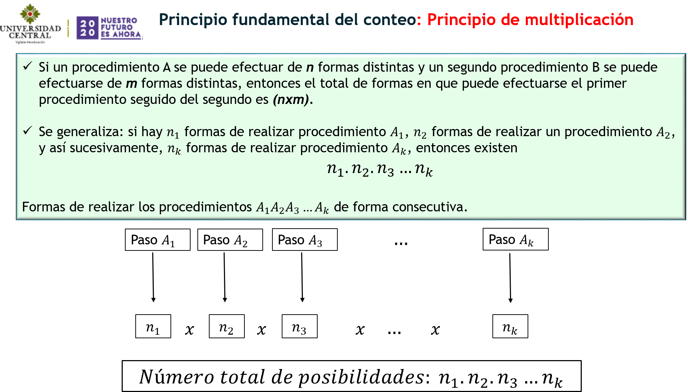
```

Veamos algunos ejemplos

***Ejemplo 1.1***

```{r , echo=FALSE, out.width = '80%', fig.align='center'}
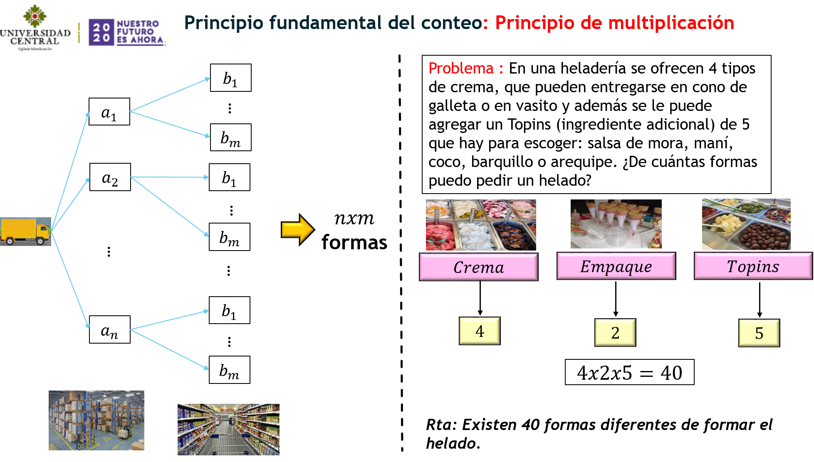
```

***Ejemplo 1.2***

```{r , echo=FALSE, out.width = '80%', fig.align='center'}
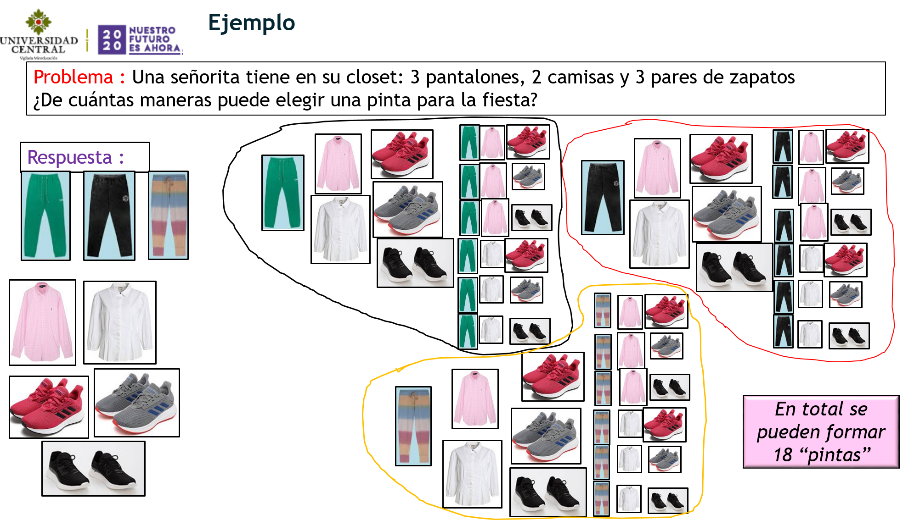
```

Usando el principio fundamental del conteo

```{r , echo=FALSE, out.width = '80%', fig.align='center'}
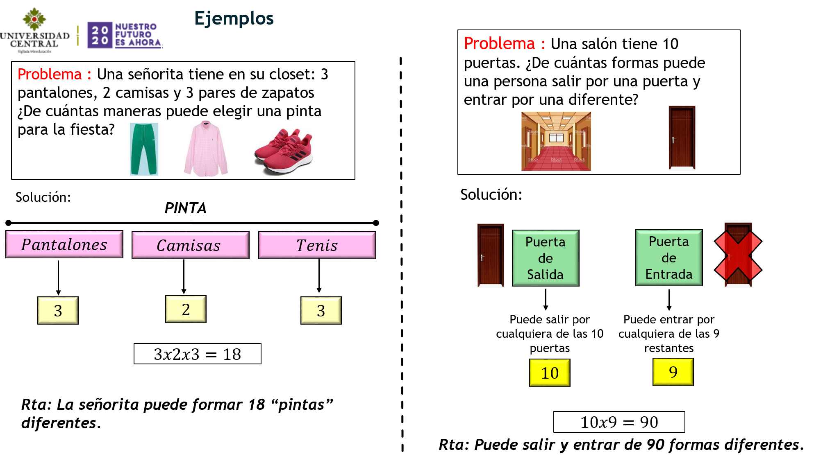
```

***Ejemplo 1.3***

```{r , echo=FALSE, out.width = '80%', fig.align='center'}
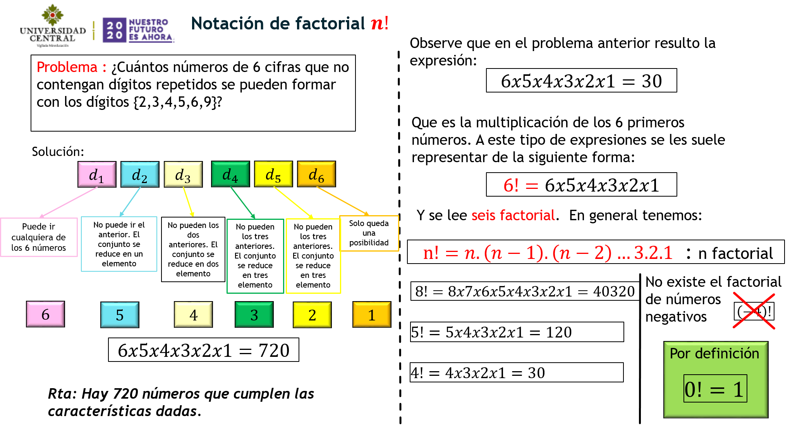
```

### ***Ordenaciones.***


Supongamos que tenemos un conjunto con $n$ elementos y deseamos extraer $k$ elementos de uno en uno de manera secuencial, es decir, con orden. 

```{r , echo=FALSE, out.width = '80%', fig.align='center'}
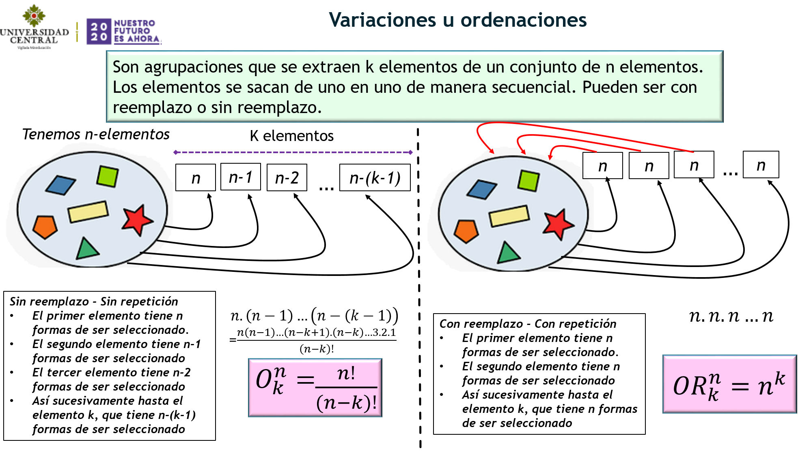
```

Veamos algunos ejemplos

- <span style="color:Blue">Ejemplo 2.1 </span>¿ Cuántas claves de 5 caracteres se pueden construir con un conjunto de 60 caracteres diferentes?

```{r}
60*60*60*60*60
```

- <span style="color:Blue">Ejemplo 2.2 </span>En una carrera participan 6 corredores, ¿ de cuántas formas distintas pueden registrarse los 3 primeros lugares?

```{r}
6*5*4
factorial(6)/factorial(6-3)
```

- <span style="color:Blue">Ejemplo 2.3 </span>En una carrera participan 6 corredores, ¿ de cuántas formas distintas pueden registrarse las seis posiciones?

```{r}
6*5*4*3*2*1
factorial(6)/factorial(6-6)
```

#### ***Combinaciones.***

En esta sección trabajaremos el concepto de combinación. Suponga que se tiene un conjunto de $n$ elementos y se extrae un grupo de $k$ elementos (muestra) donde no importa el orden de los elementos. La pregunta en cuestión es :

- <span style="color:orange">¿cuántas muestras diferentes de $k$ elementos puedo extraer de un conjunto de $n$ elementos si no importa el orden de los elementos?</span>

Esto último significa lo siguiente: Supongamos que tenemos el conjunto $\{carro, casa, perro\}$, si extraemos grupos de dos elementos podemos formar: $\{carro, casa\}$ , $\{carro, perro\}$ , $\{casa, perro\}$. Observe que el conjunto  $\{carro, casa\}$ y $\{casa, carro\}$ es el mismo. A esto se refiere el hecho de que no importa el orden. 

```{r , echo=FALSE, out.width = '80%', fig.align='center'}
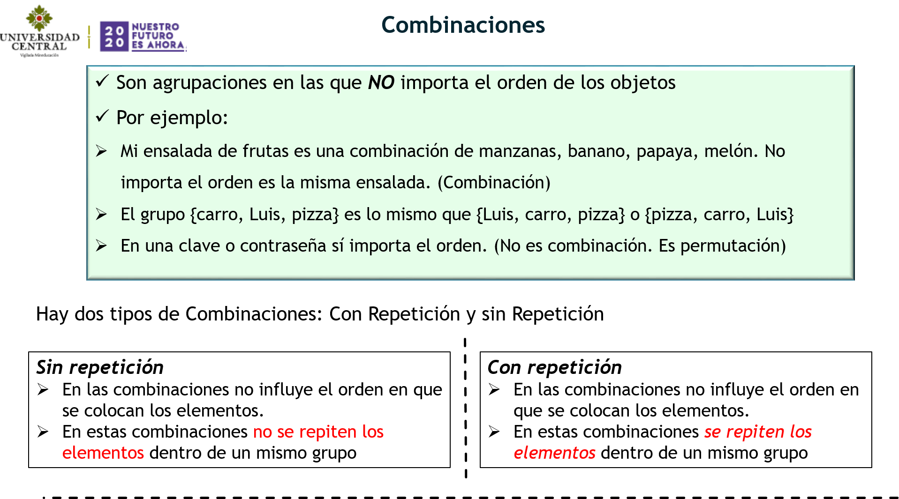
```

Veamos primero, la fórmula para la extracción sin repetición. 

- <span style="color:orange">Combinación sin repetición (es decir, sin reemplazo)</span>

```{r , echo=FALSE, out.width = '80%', fig.align='center'}
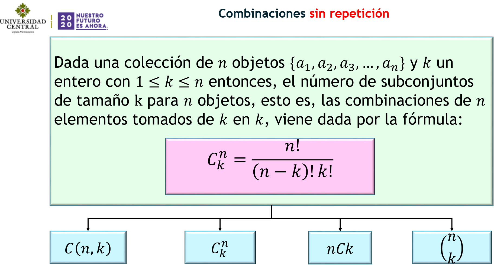
```

Veamos un par de ejemplos

***Ejemplo 3.1***

```{r , echo=FALSE, out.width = '80%', fig.align='center'}
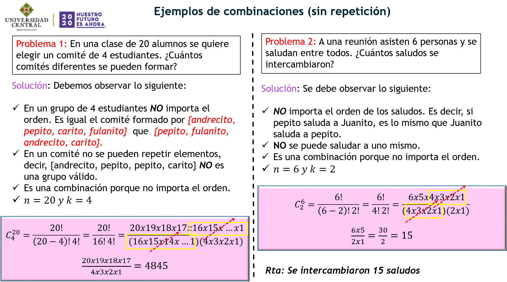
```

Para la solución en R. Usamos los siguientes comandos;

Problema 1: Sin reemplazo y sin Orden

```{r}
#nsamp(n = 20, k = 4, replace = FALSE, ordered = FALSE)    
```

Problema 2: Sin reemplazo y sin Orden

```{r}
#nsamp(n = 6, k = 2, replace = FALSE, ordered = FALSE)    
```

- <span style="color:orange">Combinación con repetición(es decir, con reemplazo)</span>

```{r , echo=FALSE, out.width = '80%', fig.align='center'}
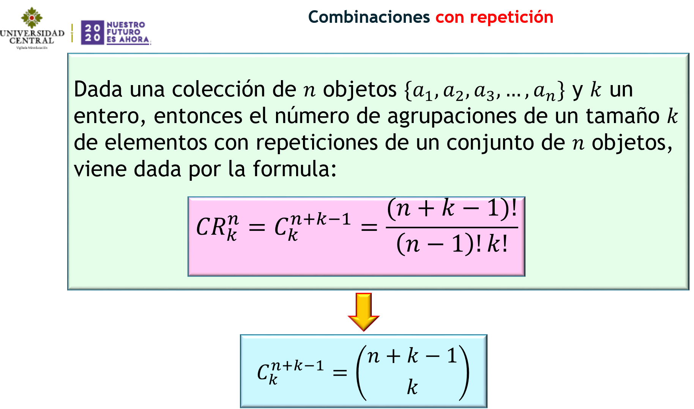
```

Veamos algunos ejemplos

***Ejemplo 3.2***

```{r , echo=FALSE, out.width = '80%', fig.align='center'}
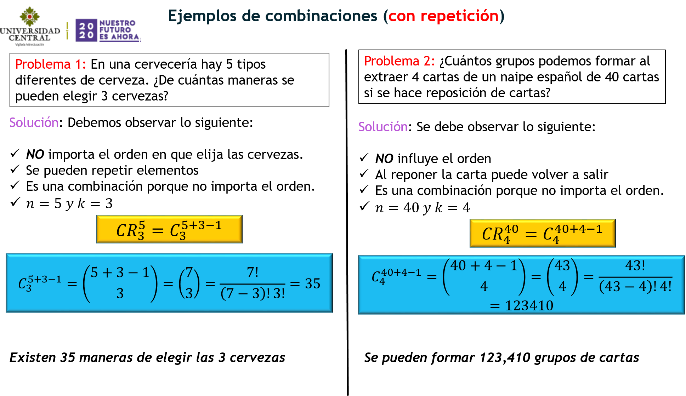
```

Resolvamos los ejercicios en R

Problema 1: Con reemplazo y sin Orden

```{r}
#nsamp(n = 5, k = 3, replace = TRUE, ordered = FALSE)    
```

Problema 2: Con reemplazo y sin Orden

```{r}
#nsamp(n = 40, k = 4, replace = TRUE, ordered = FALSE)    
```


#### ***Permutaciones.***


En esta sección trabajaremos el concepto de permutación. Suponga que se tiene un conjunto de $n$ elementos y nos preguntamos

- <span style="color:Blue">¿De cuántas formas se pueden ordenar los $n$ elementos?</span>

```{r , echo=FALSE, out.width = '80%', fig.align='center'}
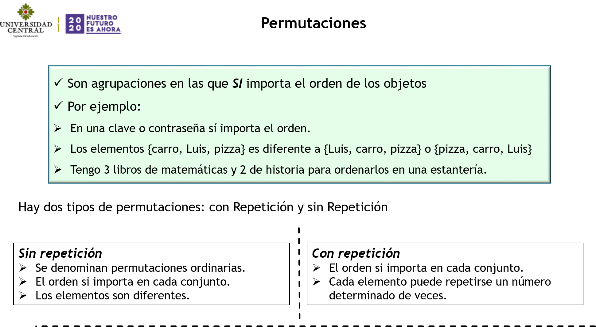
```

- <span style="color:purple">Permutaciones sin repetición</span>

En este caso vamos a suponer que tenemos $n$ elementos los cuales los vamos a ordenar y supondremos que en este conjunto no hay elementos repetidos.

```{r , echo=FALSE, out.width = '80%', fig.align='center'}
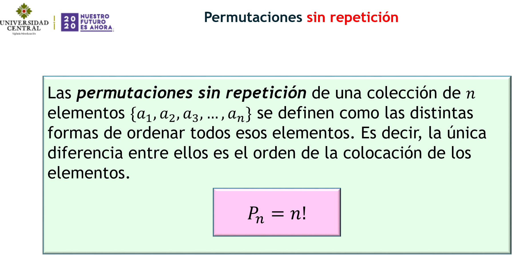
```

Veamos ahora, un par de ejemplos:

***Ejemplo 4.1***


```{r , echo=FALSE, out.width = '80%', fig.align='center'}
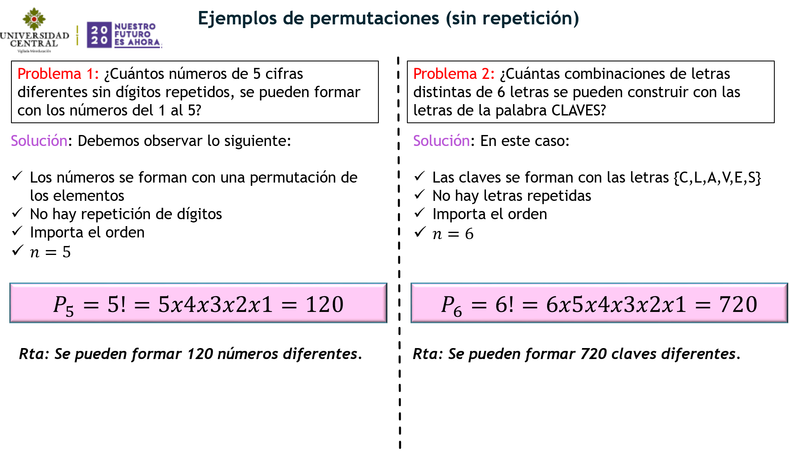
```

Para realizar estos cálculos en R tebemos dos opciones:

- La función *factorial*

- La misma función que venimos trabajando *nsamp* pero en este caso *ordered=TRUE*

- Para el problema 1: 

```{r}
#factorial(5)  # la fórmula con factorial 
#nsamp(n = 5, k = 5, replace = FALSE, ordered = TRUE)    
```

- Para el problema 2:

```{r}
#factorial(6)
#nsamp(n = 6, k = 6, replace = FALSE, ordered = TRUE)    
```

#### ***Permutaciones con repetición.***

En este caso vamos a suponer que tenemos $n$ elementos en los cuales hay elementos repetidos.

```{r , echo=FALSE, out.width = '80%', fig.align='center'}
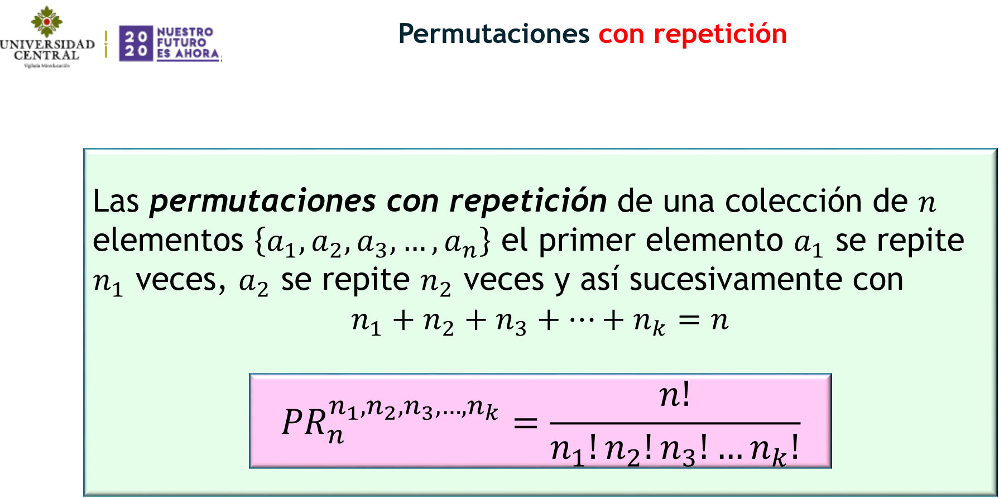
```

Veamos algunos ejemplos

***Ejemplo 4.2***

```{r , echo=FALSE, out.width = '80%', fig.align='center'}
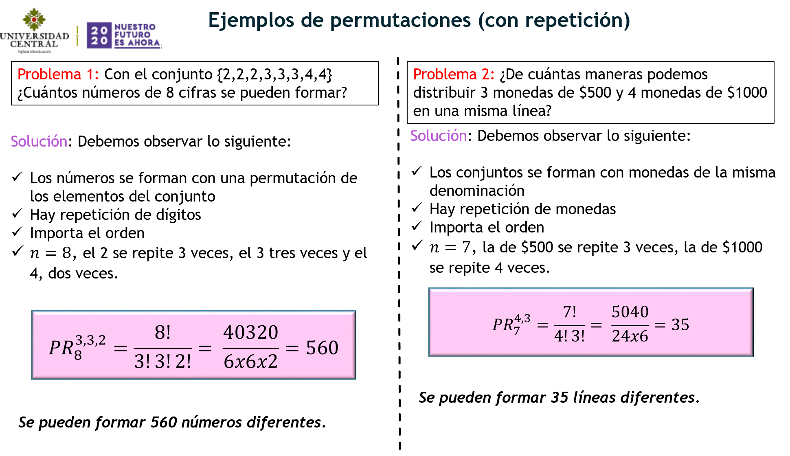
```

Finalmente, un resumen de las técnicas de conteo

#### ***Resumen.***

```{r , echo=FALSE, out.width = '80%', fig.align='center'}
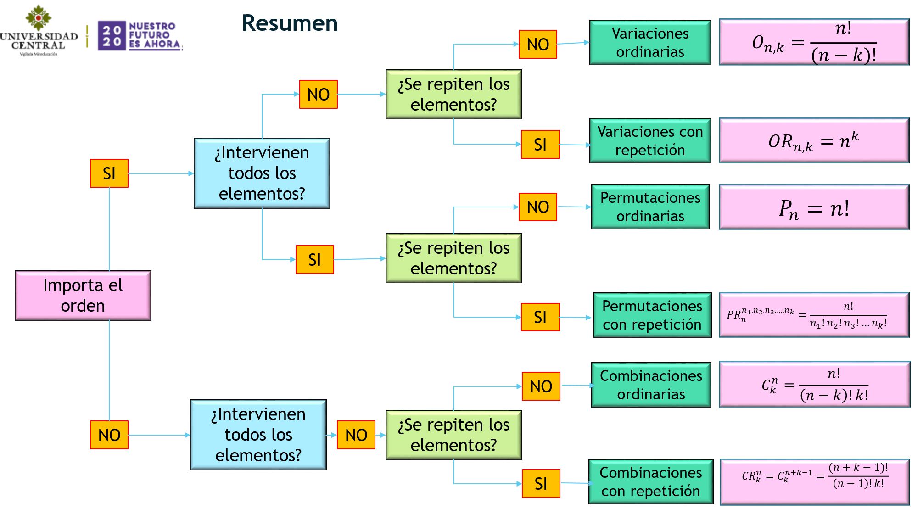
```


## ***Ejercicios***
Resuelva cada uno de los siguientes ejercicios.

- Una  clase  consta  de  seis  niñas  y  10  niños.  Si  se  escoge  un  comité  de  tres  al azar, hallar la probabilidad de: a) Seleccionar tres niños, b) Seleccionar exactamente dos niños y una niña. c) Seleccionar por lo menos un niño.


- En una baraja de 52 cartas. Tenemos cuatro palos, numerados del 1 al 10 y además J,Q,K. ¿Cuántas manos diferentes de cinco cartas se pueden formar?

- ¿Cuántas apuestas se pueden hacer en el Baloto? Tenga en cuenta que son 43 números y se escogen 5.

- Tenemos un grupo compuesto por 6 hombres y 8 mujeres. Calcular:

   + ¿De cuántas formas se puede escoger 4 hombres y 5 mujeres.}
   
   + ¿De cuántas formas se puede escoger un grupo formado por 3 hombres y 4 mujeres, si en el grupo debe estar una mujer determinada.
   
¿De cuántas maneras pueden sentarse 9 niñas en una fila de 9 asientos?

¿De cuántas formas pueden quedar clasificados 3 equipos de fútbol que participan en un torneo? 

¿Cuántas placas de 3 letras y tres números se pueden formar?

¿Cuántas números pares de tres cifras se pueden formar con los números {0,1,2,…7}

---
## ***Probabilidad:***

---

El concepto de probabilidad esta asociado a una medida intuitiva de la posibilidad de que un evento ocurra. De esta manera vamos a definir la probabilidad de que un evento $A$ ocurra de la siguiente forma:

### ***Definición (Probabilidad):***
 Sea $A$ un experimento aleatorio con espacio muestral $\Omega$ y supongamos que todos los elementos de $\Omega$ tienen las mismas posibilidades de ocurrencia (es decir, equiprobable). Se define la probabilidad clásica (o de Laplace) de un evento $A \subseteq \Omega$ como:

$$P(A) =  \dfrac{\text{numero de casos favorables}}{\text{numero de casos
posibles}}= \dfrac{\# A}{\# \Omega}$$

Veamos algunos ejemplos: 

***Ejemplo:*** Calcular la probabilidad de que al lanzar un dado, salga el número 5.

Para cualquier ejercicio de probabilidad es necesario identificar lo siguiente.

* Experimento: Lanzar un dado.
   
+ Espacio muestral. Todos los posibles resultados $\Omega=\{1,2,3,4,5,6\}$. Tamaño del espacio muestral es $6$; $\# \Omega =6$
   
+ Evento: $A=\{\text{obtener el número 5}\}=\{5\}$. Tamaño del evento $\# A = 1$.
   
Dados los anteriores elementos, basta aplicar la fórmula

$$P(A)=\dfrac{\# A}{\# \Omega}=\dfrac{1}{6}$$
La probabilidad de que obtener un cinco en un lanzamiento de un dado es una entre seis, es decir $1/6$.   


***Ejemplo:*** Calcular la probabilidad de que al lanzar dos monedas distinguibles al mismo tiempo, por lo menos una muestre cara.

Es necesario identificar lo siguiente.

* Experimento: Lanzar dos monedas
   
+ Espacio muestral. Todos los posibles resultados $\Omega=\{(c,c), \, (c,s), \, (s,c), (s,s) \}$. Tamaño del espacio muestral es $4$; $\# \Omega =4$
   
+ Evento: $C=\{\text{obtener al menos una cara}\}=\{(c,s), \, (s,c), \, (c,c)\}$. Tamaño del evento $\# C = 3$.
   
Dados los anteriores elementos, basta aplicar la fórmula

$$P(A)=\dfrac{\# C}{\# \Omega}=\dfrac{3}{4}$$
La probabilidad de obtener una cara en el lanzamiento de dos monedas es $0.75$. Es decir, una posibilidad del $75\%$.  


***Ejemplo:*** Calcular la probabilidad de que al lanzar dos dados distinguibles la suma de las caras superiores sea siete.

Es necesario identificar lo siguiente.

* Experimento: Lanzar dos dados que se distinguen.
   
+ Espacio muestral. Todos los posibles resultados $\Omega=\{(1,1), \, (1,2), \, (1,3), \dots, (6,6) \}= \{(x,y) \mid x,y=1,2,3, \dots, 6\}$. Tamaño del espacio muestral es $36$; $\# \Omega =36$
   
+ Evento: $D=\{\text{suma de los resultados es 7}\}=\{(1,6),\, (6,1), \, (2,5), \, (5,2), \, (3,4), \, (4,3)\}$. Tamaño del evento $\# D = 6$.
   
Dados los anteriores elementos, basta aplicar la fórmula

$$P(A)=\dfrac{\# D}{\# \Omega}=\dfrac{6}{36}=\dfrac{1}{6}$$
La probabilidad de que la suma de los valores en los dados sea siete es $1/6 \approx 0,166$.  


***Ejemplo:***

En un grupo de 1000 hombres y de 1500 mujeres se escogen al azar a dos personas. ¿Cuál es la probabilidad de que ambas personas sean mujeres? ¿ Cuál es la probabilidad de escoger un hombre y una mujer?

Es necesario identificar lo siguiente.

* Experimento: Escoger dos personas de un conjunto de 2500 personas donde 1000 son hombre y 1500 son mujeres.
   
+ Espacio muestral. Todos los posibles resultados $\Omega=\{(H1,H2),\, (H1,H3), \dots (M1,M2), \, (M1, M3), \dots , (H1,M1), \, (H1, M2), \dots \}$. Ahora, la preguntas es: ¿Cuál es el tamaño de $\Omega$ ?
   
+ Evento: $D=\{\text{las personas extraidas sean dos mujeres}\}=\{(M1,M2), \, (M1,M3), \, (M2,M3), \dots\}$. ¿Cuál es el tamaño del evento?
   
Si desconocemos los tamaños de estos conjuntos no podemos calcular la probabilidad. 

Existen otras definiciones de probabilidad.

#### ***Probabilidad Geométrica:***

Dados dos conjuntos acotados $A$ y $\Omega$, donde $\Omega$ es el espacio muestral, podemos definir la probabilidad de A, mediante

$$P(A)=\dfrac{\text{Area de A}}{\text{Area de} \, \Omega}$$

#### ***Probabilidad Axiomática***

La probabilidad es una función $P$, 

$$P \, : \,   \text{coleccion de eventos} \to [0,1]$$
que satisface:

1. $P(A) \geq 0$

2. $P(\Omega)=1$

3. $P \left ( \cup_{k=1}^{\infty} A_k \right) = \sum \limits_{k=1}^{\infty} P(A_k)$, para conjuntos disyuntos dos a dos, es decir, mutuamente excluyentes.

Propiedades

- $P(\phi)=0$

- $P \left ( \cup_{k=1}^n A_k \right)= \sum \limits_{k=1}^{n} P(A_k)$, para conjuntos disyuntos dos a dos.

- $P(A^c)=1-P(A)$

- Si $A \subseteq B$ entonces $P(A) \leq P(B)$.

***Ejercicio 1:***

Vamos a retomar la tabla de información `fumadores.csv`. Vuelva a una lectura pasada y cargue la table. A partir de la tabla responda.


1. Si la empresa hizo un sorteo para cada región individualmente, ¿cuál es la probabilidad de que la persona seleccionada esté en la región donde se tiene la tasa más alta de fumadores y sea fumadora?

2. Si la empresa hizo un sorteo para todas las regiones, ¿cuál es la probabilidad de que se seleccione un fumador de la región donde se tiene más fumadores?

***Ejercicio 2:***

> En un juego de un casino de dudosa reputación, un dado está arreglado de manera que cada número impar tiene el doble de probabilidad de ocurrir que un número par. Encuentre:

>> $P(G)$, donde $G$ es el evento que un número mayor que 3 ocurra en un solo lanzamiento.

***Solución Ejercicio 2:***


Luego $k=\frac{1}{9}$.


---

> <font color="Magenta" FONT SIZE=5> Para entregar.</font>

---


> <font color="Magenta" FONT SIZE=4>**Ejercicio 1:**</font>

Dos amigos acuerdan encontrarse en cierto lugar pero olvidan la hora exacta de la cita, únicamente recuerdan que era entre las 12:00 y las 13:00 horas. Cada uno de ellos decide llegar al azar en ese lapso y esperar únicamente 10 minutos. ¿Cuál es la probabilidad de que los amigos se encuentren? 

> <font color="Magenta" FONT SIZE=4>**Ejercicio 2:**</font> 

Una varilla de metal de longitud $L$ se rompe en dos puntos escogidos al azar. ¿Cuál es la probabilidad de que los tres segmentos así obtenidos formen un triángulo?

</div>


